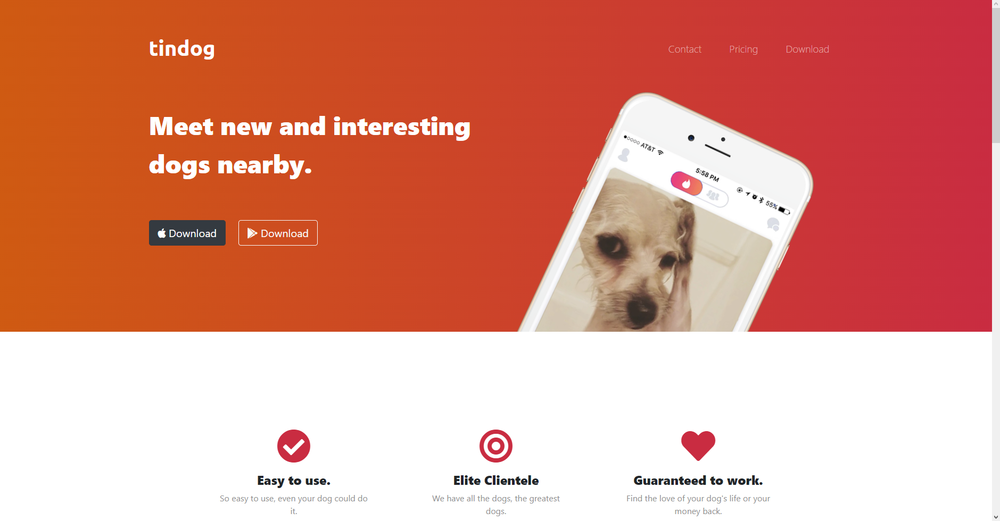

# Tindog Website
Simple project to practice CSS and Bootstrap. 
It was created through the [The Complete Web Development Course](https://www.udemy.com/course/the-complete-web-development-bootcamp/) on Udemy.

 

